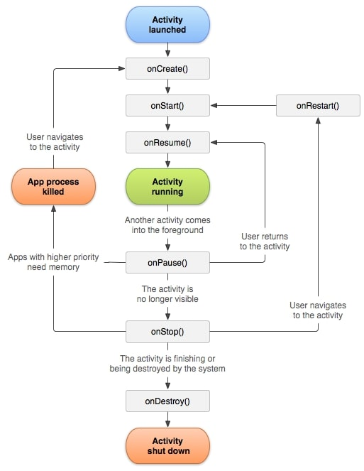

# Interview Android
## Оглавление
 - [ЖЦ Activity](#жц_активити)
 - [Ссылки на полезные материалы](#источники)

## ЖЦ Activity  

  

### onCreate()
Метод onCreate() вызывается при создании или перезапуска активности. 

Здесь вы выполняете логику, которая должна выполняться только один раз за все время активити. Сюда можно включить настройку контент вью, связывание активити с ViewModel, создание экземпляров некоторых переменных области класса и т.д.

### onStart()
Вызывается непосредственно перед тем, как активность становится видимой пользователю. Сопровождается вызовом метода onResume(), если активность получает передний план, или вызовом метода onStop(), если становится скрытой.

### onResume()
Метод onResume() вызывается после onStart(), даже когда окно работает в приоритетном режиме и пользователь может его наблюдать. В этот момент пользователь взаимодействует с созданным вами окном. Приложение получает монопольные ресурсы. Запускает воспроизведение анимации, аудио и видео. Также может вызываться после onPause().

Имейте в виду, что система вызывает этот метод каждый раз, когда ваша активность идёт на переднем плане, в том числе, при первом создании. Таким образом, вы должны реализовать onResume() для инициализации компонентов, регистрации любых широковещательных приёмников или других процессов, которые вы освободили/приостановили в onPause() и выполнять любые другие инициализации, которые должны происходить, когда активность вновь активна.

### onPause()
Когда пользователь решает перейти к работе с новым окном, система вызовет для прерываемого окна метод onPause(). По сути происходит свёртывание активности. Сохраняет незафиксированные данные. Деактивирует и выпускает монопольные ресурсы. Останавливает воспроизведение видео, аудио и анимацию. От onPause() можно перейти к вызову либо onResume(), либо onStop().

В этом методе необходимо остановить анимацию и другие действия, которые загружают процессор. Зафиксировать несохранённые данные, потому как после его выполнения работа активности может прерваться без предупреждения. Освободить системные ресурсы.

### onStop()
Метод onStop() вызывается, когда окно становится невидимым для пользователя. Это может произойти при её уничтожении, или если была запущена другая активность, перекрывшая окно текущей активности. Всегда сопровождает любой вызов метода onRestart(), если активность возвращается, чтобы взаимодействовать с пользователем, или метода onDestroy(), если эта активность уничтожается.

Когда ваша активность останавливается, объекты активности хранятся в памяти и восстанавливаются, когда активность возобновляет свою работу. Вам не нужно повторно инициализировать компоненты, которые были созданы ранее. Кроме того, система отслеживает текущее состояние для каждого представления, поэтому, если пользователь введёт текст в текстовое поле, то его содержание сохраняется и вам не нужно сохранять и восстанавливать его.

В этом методе можно сделать сложные операции по сохранению данных: для приостановки сложной анимации, потоков, отслеживания показаний датчиков, запросов к GPS, таймеров, сервисов или других процессов, которые нужны исключительно для обновления пользовательского интерфейса. Нет смысла потреблять ресурсы для обновления интерфейса, в то время как он не виден на экране. Примените методы onStart() или onRestart() для возобновления или повторного запуска этих процессов, когда активность опять станет видимой.

При нехватке памяти система может уничтожить скрытую активность, минуя метод onStop() с вызовом метода onDestroy().

### onRestart()
Если окно возвращается в приоритетный режим после вызова onStop(), то в этом случае вызывается метод onRestart(). Т.е. вызывается после того, как активность была остановлена и снова была запущена пользователем. Всегда сопровождается вызовом метода onStart().

onRestart предшествует вызовам метода onStart() (кроме самого первого). Используйте его для специальных действий, которые должны выполняться только при повторном запуске активности в рамках «полноценного» состояния.

### onDestroy()
Метод вызывается по окончании работы активности, при вызове метода finish() или в случае, когда система уничтожает этот экземпляр активности для освобождения ресурсов. Эти два сценария уничтожения можно определить вызовом метода isFinishing(). Вызывается перед уничтожением активности. Это последний запрос, который получает активность от системы. Если определённое окно находится в верхней позиции в стеке, но невидимо пользователю и система решает завершить это окно, вызывается метод onDestroy(). В этом случае метод удаляет все статические данные активности. Отдаёт все используемые ресурсы.

## Ссылки на полезные материалы 
- [Памятка по жизненному циклу Android.](https://habr.com/ru/post/569092/)
