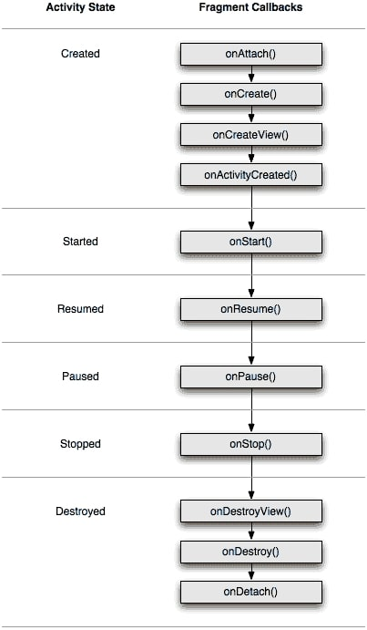
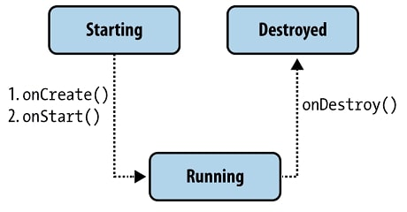
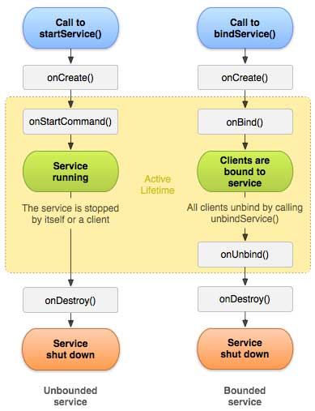

# Interview Android
## Оглавление
 - [ЖЦ Activity](#жц_активити)
 - [ЖЦ Fragment](#жц_фрагмента)
 - [Компоненты Android-приложения](#компоненты)
 - [Cинхронизация](#cинхронизация)
 - [Ссылки на полезные материалы](#источники)

## ЖЦ Activity 

  

### onCreate()
Метод onCreate() вызывается при создании или перезапуска активности. 

Здесь вы выполняете логику, которая должна выполняться только один раз за все время активити. Сюда можно включить настройку контент вью, связывание активити с ViewModel, создание экземпляров некоторых переменных области класса и т.д.

### onStart()
Вызывается непосредственно перед тем, как активность становится видимой пользователю. Сопровождается вызовом метода onResume(), если активность получает передний план, или вызовом метода onStop(), если становится скрытой.

### onResume()
Метод onResume() вызывается после onStart(), даже когда окно работает в приоритетном режиме и пользователь может его наблюдать. В этот момент пользователь взаимодействует с созданным вами окном. Приложение получает монопольные ресурсы. Запускает воспроизведение анимации, аудио и видео. Также может вызываться после onPause().

Имейте в виду, что система вызывает этот метод каждый раз, когда ваша активность идёт на переднем плане, в том числе, при первом создании. Таким образом, вы должны реализовать onResume() для инициализации компонентов, регистрации любых широковещательных приёмников или других процессов, которые вы освободили/приостановили в onPause() и выполнять любые другие инициализации, которые должны происходить, когда активность вновь активна.

### onPause()
Когда пользователь решает перейти к работе с новым окном, система вызовет для прерываемого окна метод onPause(). По сути происходит свёртывание активности. Сохраняет незафиксированные данные. Деактивирует и выпускает монопольные ресурсы. Останавливает воспроизведение видео, аудио и анимацию. От onPause() можно перейти к вызову либо onResume(), либо onStop().

В этом методе необходимо остановить анимацию и другие действия, которые загружают процессор. Зафиксировать несохранённые данные, потому как после его выполнения работа активности может прерваться без предупреждения. Освободить системные ресурсы.

### onStop()
Метод onStop() вызывается, когда окно становится невидимым для пользователя. Это может произойти при её уничтожении, или если была запущена другая активность, перекрывшая окно текущей активности. Всегда сопровождает любой вызов метода onRestart(), если активность возвращается, чтобы взаимодействовать с пользователем, или метода onDestroy(), если эта активность уничтожается.

Когда ваша активность останавливается, объекты активности хранятся в памяти и восстанавливаются, когда активность возобновляет свою работу. Вам не нужно повторно инициализировать компоненты, которые были созданы ранее. Кроме того, система отслеживает текущее состояние для каждого представления, поэтому, если пользователь введёт текст в текстовое поле, то его содержание сохраняется и вам не нужно сохранять и восстанавливать его.

В этом методе можно сделать сложные операции по сохранению данных: для приостановки сложной анимации, потоков, отслеживания показаний датчиков, запросов к GPS, таймеров, сервисов или других процессов, которые нужны исключительно для обновления пользовательского интерфейса. Нет смысла потреблять ресурсы для обновления интерфейса, в то время как он не виден на экране. Примените методы onStart() или onRestart() для возобновления или повторного запуска этих процессов, когда активность опять станет видимой.

При нехватке памяти система может уничтожить скрытую активность, минуя метод onStop() с вызовом метода onDestroy().

### onRestart()
Если окно возвращается в приоритетный режим после вызова onStop(), то в этом случае вызывается метод onRestart(). Т.е. вызывается после того, как активность была остановлена и снова была запущена пользователем. Всегда сопровождается вызовом метода onStart().

onRestart предшествует вызовам метода onStart() (кроме самого первого). Используйте его для специальных действий, которые должны выполняться только при повторном запуске активности в рамках «полноценного» состояния.

### onDestroy()
Метод вызывается по окончании работы активности, при вызове метода finish() или в случае, когда система уничтожает этот экземпляр активности для освобождения ресурсов. Эти два сценария уничтожения можно определить вызовом метода isFinishing(). Вызывается перед уничтожением активности. Это последний запрос, который получает активность от системы. Если определённое окно находится в верхней позиции в стеке, но невидимо пользователю и система решает завершить это окно, вызывается метод onDestroy(). В этом случае метод удаляет все статические данные активности. Отдаёт все используемые ресурсы.

## ЖЦ Fragment  

У фрагментов есть жизненный цикл, который во многом совпадает с жизненным циклом активности, внутри которой они находятся.

  

### onAttach(Activity)
Вызывается, когда фрагмент связывается с активностью. С этого момента мы можем получить ссылку на активность через метод getActivity().

### onCreate()
В этом методе можно сделать работу, не связанную с интерфейсом.

### onCreateView(LayoutInflater, ViewGroup, Bundle)
Вызывается для создания компонентов внутри фрагмента

### onViewCreated()
Вызывается сразу после onCreateView()

### onActivityCreated(Bundle)
Вызывается, когда отработает метод активности onCreate(), а значит фрагмент может обратиться к компонентам активности

### onStart()
Вызывается, когда фрагмент видим для пользователя и сразу же срабатывает onStart() активности

### onDestroyView()
Вызывается, когда набор компонентов удаляется из фрагмента

### onResume()
Вызываем после onResume() активности

### onDetach()
Вызывается, когда фрагмент отвязывается от активности

## Компоненты Android-приложения  

Компоненты являются основными строительными блоками приложения Android. Каждый компонент является точкой входа в приложение.

Существуют 4 различных типа компонентов:
 - [Activities](#activities)
 - [Services](#services)
 - [Broadcast receivers](#broadcast_receivers)
 - [Content providers](#content_providers)

Каждый тип служит определенной цели и имеет отдельный жизненный цикл, который определяет, как создается и уничтожается компонент. 

Система компонентов и intent’ов Android позволяет приложениям, по-прежнему абсолютно ничего друг о друге не зная, составлять для пользователя один интегрированный системный user experience — установленные приложения реализуют части одной большой системы, они составляют из себя систему.

### Activities (и Intent) 

Activity является отправной точкой для взаимодействия с пользователем.

Intent — это сообщение, которое указывает системе, что нужно «сделать» (например, открыть данный URL, написать письмо на данный адрес, позвонить на данный номер телефона или сделать фотографию).

Приложение может создать такой intent и передать его системе, а система решает, какая activity (или другой компонент) будет его выполнять (handle). Эта activity запускается системой (в существующем процессе приложения или в новом, если он ещё не запущен), ей передаётся этот intent, и она его выполняет.

Intent’ы могут быть явными (explicit) и неявными (implicit). Явный intent указывает идентификатор конкретного компонента, который нужно запустить — чаще всего это используется, чтобы запустить из одной activity другую внутри одного приложения (при этом intent может даже не содержать другой полезной информации).

Неявный intent обязательно должен указывать действие, которое нужно сделать. Каждая activity (и другие компоненты) указывают в манифесте приложения, какие intent’ы они готовы обрабатывать (например, ACTION_VIEW для ссылок с доменом https://example.com). Система выбирает подходящий компонент среди установленных и запускает его.

Если в системе есть несколько activity, которые готовы обработать intent, пользователю будет предоставлен выбор. Обычно это случается, когда установлено несколько аналогичных приложений, например несколько браузеров или фоторедакторов. Кроме того, приложение может явно попросить систему показать диалог выбора (на самом деле при этом переданный intent оборачивается в новый intent с ACTION_CHOOSER) — это обычно используется для создания красивого диалога Share.

Кроме того, activity может вернуть результат в вызвавшую её activity. Например, activity в приложении-камере, которая умеет обрабатывать intent «сделать фотографию» (ACTION_IMAGE_CAPTURE) возвращает сделанную фотографию в ту activity, которая создала этот intent.

### Services 

Service - это универсальная точка входа для поддержания работы приложения в фоновом режиме по самым разным причинам. Это компонент, который работает в фоновом режиме для выполнения длительных операций или для выполнения работы для удаленных процессов. Service не предоставляет пользовательский интерфейс. 

Android даёт службам более высокий приоритет, чем бездействующим активностям, поэтому вероятность того, что они будут завершены из-за нехватки ресурсов, заметно уменьшается.

  

Подобно активности, для служб производят начальную инициализацию в onCreate() и освобождают все остающиеся ресурсы в onDestroy()

Из своего приложения службу можно запустить вызовом метода Context.startService(), остановить через Context.stopService(). Служба может остановить сама себя, вызывая методы Service.stopSelf() или Service.stopSelfResult().

Можно установить подключение к работающей службе и использовать это подключение для взаимодействия со службой. Подключение устанавливают вызовом метода Context.bindService() и закрывают вызовом Context.unbindService(). Если служба уже была остановлена, вызов метода bindService() может её запустить.

Существует два типа служб:
 - Started services (сообщают системе, чтобы они продолжали работать, пока их работа не будет завершена)
 - Bound services (запускаются, потому что какое-то другое приложение (или система) заявило, что оно хочет воспользоваться сервисом.)

Bound service позволяет осуществлять расширенную двустороннюю связь между активностью и службой, тогда как Started service не должна возвращать никаких результатов в активность.

Bound service будет обслуживать несколько клиентов (при условии, что к ней привязан хотя бы один клиент), в то время как Started service выполняет одну операцию, а затем завершает работу. (могут быть Started service, которые также связаны)

В то же время Started services можно разделить еще на два типа:
 - Foreground service (Сервис, выполняющий действие, состояние которого важно для пользователя, например, загрузка файла или воспроизведение музыки. Такой сервис обязан отображать уведомление в системной шторке уведомлений. Система считает такой сервис примерно настолько же важным для пользователя, как и текущая activity, и завершит его только в крайнем случае.)
 - Background service (Сервис, выполняющий фоновое действие, состояние которого не интересует пользователя (чаще всего, синхронизацию). Такие сервисы могут быть завершены при нехватке памяти с гораздо большей вероятностью.)

  

### Broadcast receivers 

Broadcast receiver — компонент, позволяющий приложению принимать broadcast’ы, специальный вид сообщений от системы или других приложений. Исходно broadcast’ы, как следует из названия, в основном использовались для рассылки широковещательных сообщений всем подписавшимся приложениям — например, система посылает сообщение AIRPLANE_MODE_CHANGED при включении или отключении самолётного режима.

### Content providers 

Content provider — компонент, позволяющий приложению предоставлять другим приложениям доступ к данным, которыми оно управляет. Пример данных, доступ к которым можно получить таким образом — список контактов пользователя.

При этом приложение может хранить сами данные каким угодно образом, в том числе на устройстве в виде файлов, в настоящей базе данных (SQLite) или запрашивать их с сервера по сети. В этом смысле content provider — это унифицированный интерфейс для доступа к данным, независимо от формы их хранения.

Взаимодействие с content provider’ом во многом похоже на доступ к удалённой базе данных через REST API. Приложение-клиент запрашивает данные по URI (например, content://com.example.Dictionary.provider/words/42) через ContentResolver. Приложение-сервер определяет, к какому именно набору данных был сделан запрос, используя UriMatcher, и выполняет запрошенное действие (query, insert, update, delete).

Именно поверх content provider’ов реализован Storage Access Framework, позволяющий приложениям, хранящим файлы в облаке (например, Dropbox и Google Photos) предоставлять доступ к ним остальным приложениям, не занимая место на устройстве полной копией всех хранящихся в облаке файлов.

## Cинхронизация 

В многопоточном мире нам необходим доступ к объектам между потоками, при отсутствии синхронизации могут возникнуть проблемы. Следовательно нужно знать как синхронизировать потоки.

### Volatile

В Java и Kotlin есть ключевое слово volatile (в Kotline в виде аннотации @volatile), которые применяются к полям и гарантируют, что считываемое значение поступает из основной памяти, а не из кэша процессора, поэтому все участники процесса будут ожидать окончания параллельной записи, прежде чем считать значение.

Volatiles используются для создания потоко-безопасных синглетонов в Java путем двойной проверки экземпляра синглтона.

###### Marks the JVM backing field of the annotated property as volatile, meaning that writes to this field are immediately made visible to other threads.

### Synchronized

В Java и Kotlin есть два типа синхронизации − синхронизированные методы и синхронизированные блоки. Для понимания − синхронизированные методы обозначается, как synchronized в Java и @Synchronized в Kotlin.

Synchronized использует концепцию блокировки монитора.

С каждым объектом в JVM связан монитор. Можно рассматривать монитор как особый токен, который поток может получить или заблокировать для получения монопольного доступа к объекту. Как только монитор объекта заблокирован, другим потокам, которые хотят работать с объектом, придется ждать, пока монитор снова не будет разблокирован.

### Атомарные примитивы

Атомарные примитивы позволяют синхронизировать действия над переменными базовых типов.

### Параллельные коллекции

Существует несколько способов обработки синхронизированных коллекций в Java.
 - Collections.synchronizedList(List<K>) является классом, который может использоваться для выполнения регулярных операций со списками (add, addAll, get, set, ...) методом синхронизации. Существуют также аналогичные реализации Map, Set и другие.
 - CopyOnWriteArrayList может использоваться для обеспечения поточно-ориентированных операций модификации в List. Любая операция изменения сначала копирует весь список в локальную переменную с помощью итератора, выполняет действие, а затем заменяет его исходным списком. Эта коллекция примечательна тем, что обход списка не требует синхронизации.
 - HashTable обеспечивает синхронизированный доступ к Map. Следует отметить, что синхронизируются только отдельные функции Map. Например, put не в их числе, поэтому безопасность потока на всей карте не гарантируется.
 - ConcurrentHashMap<K,V> можно использовать для обеспечения безопасности потоков во всех методах HashMap. Важно отметить, что операции чтения (например, get) не блокируют Map целиком.

## Ссылки на полезные материалы 
- [Памятка по жизненному циклу Android.](https://habr.com/ru/post/569092/)
- [Как работает Android](https://habr.com/ru/company/solarsecurity/blog/338494/)
- [Синхронизация в Java и Kotlin](https://proglib.io/p/kotlin-java-tips) 
