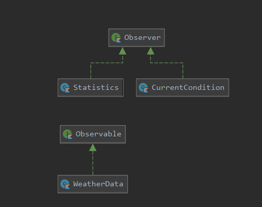

# Desing Patterns
## Паттерн стратегия
Паттерн стратегия определяет семейство алгоритмов, инкапсулирует каждый из них и обеспечивает их взаимозаменяемость. 
Он позволяет модифицировать алгоритмы независимо от их использования на стороне клиента.
[Код с простым примером.](src/Strategy/My/Strategy.kt)

  

## Паттерн наблюдатель
Паттерн наблюдатель определяет отношение "один-ко-многим" между объектами таким образом, что при изменении состояния одного объекта происходит автоматическое оповещение и обновление всех зависимых объектов.
[Код с простым примером со своей реализацией.](src/Observer/Standard/main.kt)

  

