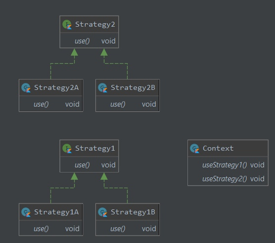

# Desing Patterns
## Паттерн стратегия
Паттерн стратегия определяет семейство алгоритмов, инкапсулирует каждый из них и обеспечивает их взаимозаменяемость. 
Он позволяет модифицировать алгоритмы независимо от их использования на стороне клиента.
[Код с простым примером.](src/Strategy/My/Strategy.kt)

  

