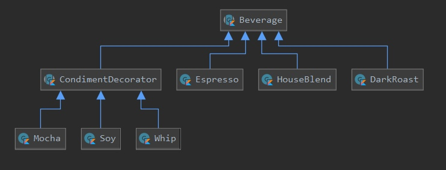

# Desing Patterns
## Паттерн стратегия
Паттерн стратегия определяет семейство алгоритмов, инкапсулирует каждый из них и обеспечивает их взаимозаменяемость. 
Он позволяет модифицировать алгоритмы независимо от их использования на стороне клиента.
[Код с простым примером.](src/strategy/my/Strategy.kt)

  

## Паттерн наблюдатель
Паттерн наблюдатель определяет отношение "один-ко-многим" между объектами таким образом, что при изменении состояния одного объекта происходит автоматическое оповещение и обновление всех зависимых объектов.
[Код с простым примером со своей реализацией.](src/observer/standard/main.kt)

  

## Паттерн декоратор
Паттерн декоратор динамически наделяет объект новыми возможностями и является гибкой альтернативой субклассированию в области расширения функциональности.
[Код с простым примером со своей реализацией.](src/decorator/my/Decorator.kt)

  

Kotlin имеет встроенную поддержку шаблона делегирования, другого шаблона, который устанавливает композицию выше наследования.
Объект внешне выражает некоторое поведение, но в реальности передаёт ответственность за выполнение этого поведения связанному объекту.
[Код с простым примером.](src/decorator/kotlin/Decorator.kt)

## Паттерн Фабрика
### Паттерн Фабричный метод
Паттерн фабричный метод определяет интерфейс создания олъекта, но позволяет субклассам выбрать класс создаваемого экземпляра. Таким образом, Фабричный метод делегирует операцию создания экземпляра субклассам. 
[Код с простым примером.](src/factory/factory_method/my/FactoryMethod.kt)

Companion object позволяет легко реализовать Фабричный метод. Объект контролирует процесс своей инициализации для того, чтобы скрывать какие-то секреты внутри себя.
[Код с простым примером (companion object).](src/factory/factory_method/kotlin/FactoryMethod.kt)

## Ссылки на полезные материалы 
- [Паттерны проектирования в Kotlin.](https://habr.com/ru/post/421873/)
- [Деллегирование в Kotlin.](https://kotlinlang.ru/docs/delegation.html)
- [Паттерн проектирования Builder (Строитель) в Java](https://habr.com/ru/company/otus/blog/552412/)
